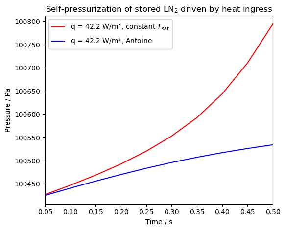
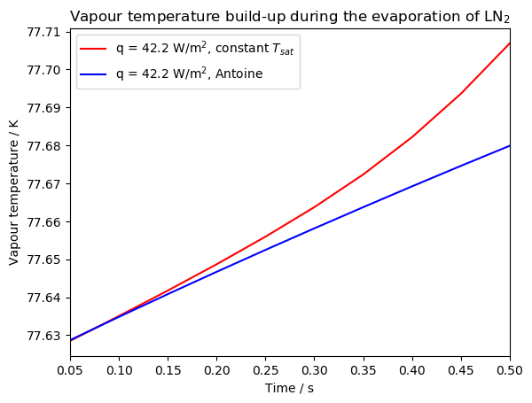

## Non-isobaric evaporation of liquid nitrogen in a closed vessel

In this tutorial, we examine the evaporation of liquid nitrogen during it's storage in a closed vessel. Liquid nitrogen is a cryogenic liquid which saturation temperature is 77.62K at 1 atm of pressure. Cryogenic liquids are normally stored in multi-layered insulated storage tanks, to minimize the heat ingress from the surroundings driven by the large temperature difference between the environment and the cryogenic liquid.

The heat ingress from the surroundings will heat and evaporate the liquid nitrogen. The liquid phase is heated through the walls, and the bottom, governed by an overall heat transfer coefficient, with a heat flux governed by an overall heat transfer coefficient.

`q_L = U_L (T_air- T_L)`

The vapour phase will be superheated with respect to the liquid and will act as an additional heat source. Additionally, as the liquid temperature increases it's density will decrease, producing a thermal expansion that will further increase the pressure of the tank decreasing the volume of the vapour.

The vapour phase is heated through the tank roof and walls by the same mechanism of the liquid, `q_V = U_L (T_air- T_V)`. The heat ingress will increase the pressure of the vapour. If the increase in saturation temperature of the system is quicker than the heating of the vapour close to the interface, some vapour will condense despite the fact that the whole system is being heated.

## Overview {closedTankEvaporation}

- Solver: reactingTwoPhaseEulerFoam
- Goals: 
* Learn how to set up a multiphase simulation with thermally driven phase change under non-isobaric conditions.
* Understand how to include thermodynamic and thermophysical properties consistently in the thermodynamicProperties and phaseProperties dictionary.
* Examine results critically after the simulation
* Perform a simple thermodynamic validation as part of the case workflow
  
- [Simulation](closedTankEvaporation)
  - example: pressure build-up during the evaporation of liquid nitrogen in a storage tank

## Workflow

1. Create the geometry
2. Setup thermodynamic and thermophysical properties of liquid nitrogen
3. Define initial and boundary conditions in the 0/ directory
4. Setup simulation settings
5. Running the simulation

## 1. Create the geometry

The geometry for this tutorial consists of a 2D cylindrical tank of 6.75L with an internal diameter d_i = 0.21m and a height h = 0.213m. In OpenFOAM, 2D axisymmetrical cylinders are modelled as wedges. The mesh was created using `blockmesh` following the
[OpenFOAM wiki AxySymmetric contribution](https://openfoamwiki.net/index.php/Main_ContribExamples/AxiSymmetric) guidelines as a template. The mesh specifications can be found in the [blockMeshDict](closedTank_coarse/system/blockMeshDict)

To create the geometry, source OpenFOAM and run `blockMesh` in any of the two case directories.

## 2. Setting up the simulation: /constant directory

### 2.1 phaseProperties

The saturation temperature of LN2 was obtained using the Antoine Equation. At 100kPa, T_sat = 77.62K. `reactingTwoPhaseEulerFoam` uses the Antoine's equation in a natural logarithm base: `ln(P) = A + B/(T+C)`. However, it is typical in the literature to find the coefficients for the Antoine's equation written in the base 10 logarithm form: `log_10(P) = A' - B'/(T+C')`. Note the change of sign of the second term between both equations. To convert the coefficients to the OpenFOAM convention, the follow algebraic relationship must be applied: `A = ln(10)*(A'+5)`, `B = -B' ln(10) `, `C = C'`. From the original coefficients for liquid nitrogen A' = 3.7362, B' = 264.651 and C' = -6.788,  [(Edejer and Thodos, 1967)](https://webbook.nist.gov/cgi/cbook.cgi?Name=nitrogen&Units=SI&cTG=on&cTC=on&cTP=on#ref-10), the transformed values were input in the `saturationModel` subdictionary of `phaseProperties`:


```c++
saturationModel
{
    type Antoine; //Prydz and Goodwin, 1972, webbook.nist.gov
    A  20.116;
    B  -609.381;
    C  -6.788;
};
```

Constant | NIST | OpenFOAM
-----|-----|-----
A | 3.7362 | 20.116
B | 264.651 | -609.381
C | -6.788 | -6.788


### 2.2 thermophysicalProperties.gas


### 2.3 thermophysicalProperties.liquid

### 2.4 turbulenceProperties

## 3. Initial and boundary conditions in 0/


## 4. Simulation settings in /system

### 4.1 setFieldsDict

### 4.2 fvOptions

## 5. Running the case

### 5.1 Examining the results with paraview

- [x] Include U profile in both phases
- [] Include T profile in both phases

### 5.2 Pressure build-up prediction using two different saturationModels


### 5.3 Vapour temperature prediction using two different saturationModels



### Further analysis

* Examine the evaporation rate with two different saturationModels. You can use paraview to obtain the average vapour or liquid fraction in through time, as well as the liquid and vapour densities. This should be sufficient to calculate the evaporation rate.

* Examine the increase in vapour and liquid enthalpies to understand how the heat ingress is distributed.

* Run the case for longer times to observe any change in shape of the pressurization rate in the case which uses the Antoine Equation as the saturation model.